# AI Platform Architecture Diagrams

## High-Level Architecture

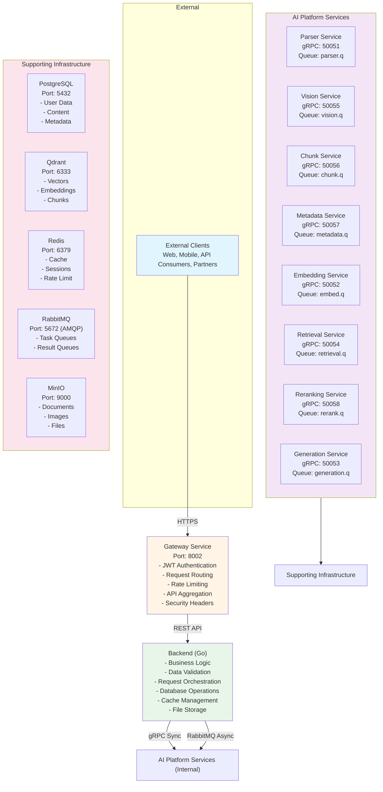

## Communication Flow Diagrams

### Synchronous Communication (gRPC)

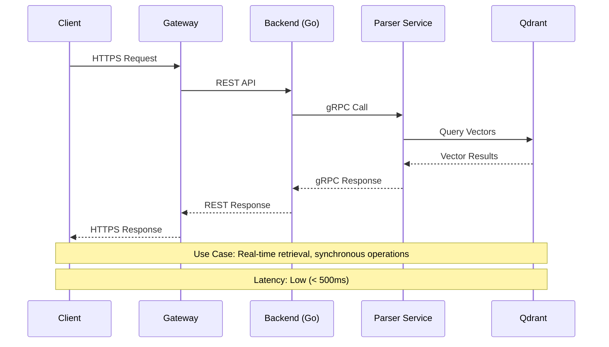

### Asynchronous Communication (RabbitMQ)

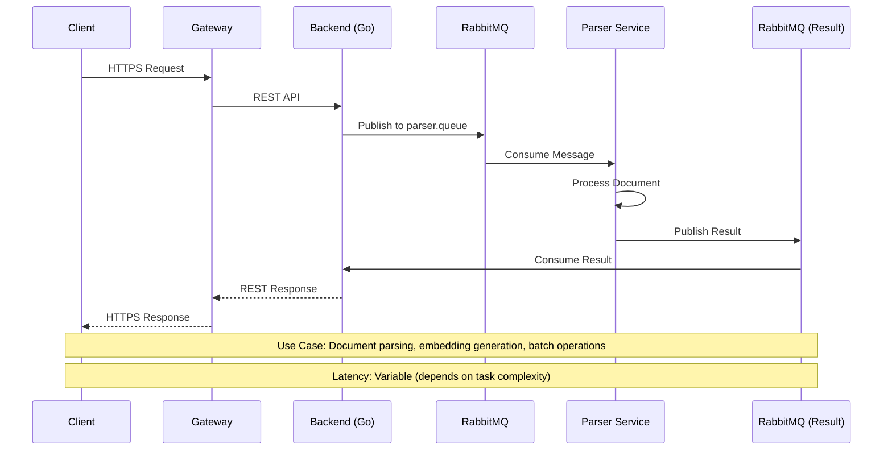

## Service Interaction Diagram

### Document Processing Pipeline

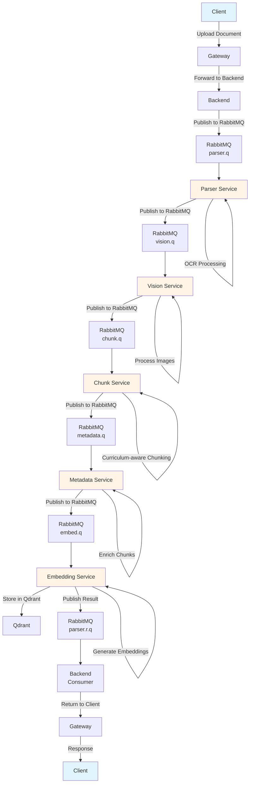

### Query Processing Pipeline

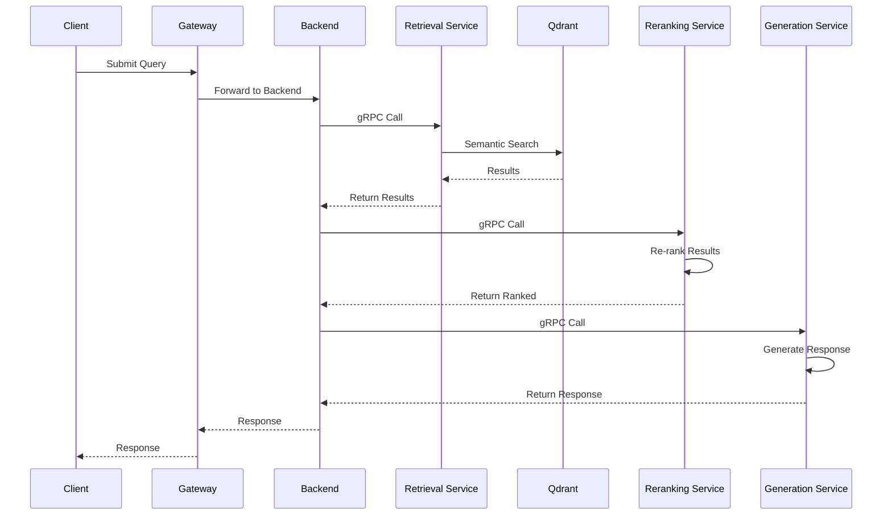

## Security Architecture

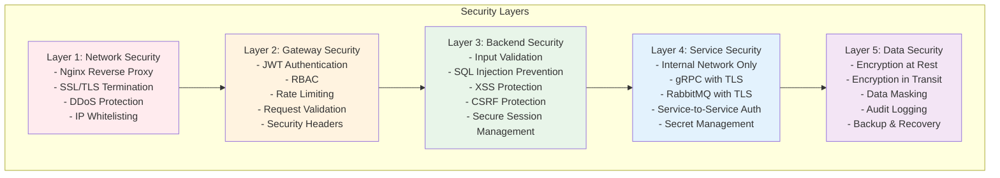

## Deployment Architecture

### Docker Compose Deployment

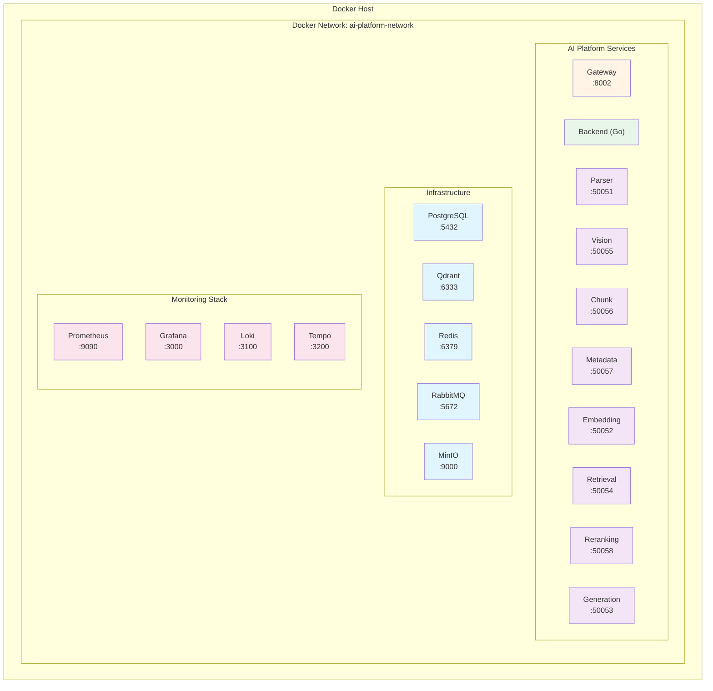

### Kubernetes Deployment

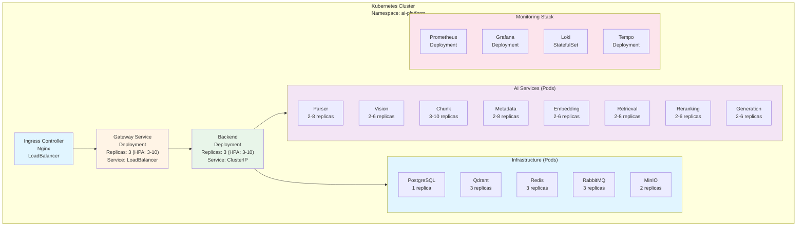

## Data Flow Architecture

### Document Upload Flow

```mermaid
graph LR
    C["Client"] --> GW["Gateway"]
    GW --> BE["Backend"]
    BE --> MN["MinIO<br/>Store"]
    BE --> RMQ1["RabbitMQ<br/>Publish"]
    RMQ1 --> PS["Parser Service<br/>Consume"]
    PS --> PS1["Process Document"]
    PS1 --> PS2["Extract Content"]
    PS2 --> VS["Vision Service<br/>via RabbitMQ"]
    VS --> VS1["Process Images"]
    VS1 --> CS["Chunk Service<br/>via RabbitMQ"]
    CS --> CS1["Curriculum-aware Chunking"]
    CS1 --> MS["Metadata Service<br/>via RabbitMQ"]
    MS --> MS1["Enrich Chunks"]
    MS1 --> ES["Embedding Service<br/>via RabbitMQ"]
    ES --> ES1["Generate Embeddings"]
    ES1 --> QD["Qdrant<br/>Store Vectors"]
    ES1 --> RMQ2["RabbitMQ<br/>Publish Result"]
    RMQ2 --> BE2["Backend<br/>Consume Result"]
    BE2 --> DB["Update Database"]
    DB --> GW2["Gateway"]
    GW2 --> C2["Client<br/>Response"]
    
    style C fill:#e1f5ff
    style C2 fill:#e1f5ff
    style PS fill:#fff4e6
    style VS fill:#fff4e6
    style CS fill:#fff4e6
    style MS fill:#fff4e6
    style ES fill:#fff4e6
```

### Query Flow

```mermaid
graph LR
    C["Client"] --> GW["Gateway"]
    GW --> BE["Backend<br/>Query"]
    BE --> RS["Retrieval Service<br/>gRPC"]
    RS --> QD["Qdrant<br/>Semantic Search"]
    QD --> BE1["Backend<br/>Return Results"]
    BE1 --> RRS["Reranking Service<br/>gRPC"]
    RRS --> RRS1["Re-rank Results"]
    RRS1 --> BE2["Backend<br/>Return Ranked"]
    BE2 --> GS["Generation Service<br/>gRPC"]
    GS --> GS1["Generate Response"]
    GS1 --> BE3["Backend<br/>Return Response"]
    BE3 --> GW2["Gateway"]
    GW2 --> C2["Client<br/>Response"]
    
    style C fill:#e1f5ff
    style C2 fill:#e1f5ff
    style RS fill:#fff4e6
    style RRS fill:#fff4e6
    style GS fill:#fff4e6
```

## Monitoring Architecture

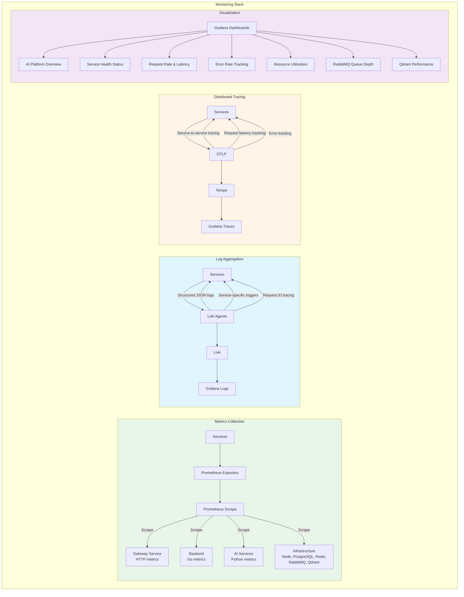

## Port Summary

| Service | REST Port | gRPC Port | RabbitMQ Queue | External Access |
|---------|-----------|-----------|---------------|-----------------|
| Gateway | 8002 | N/A | N/A | Yes (HTTPS) |
| Backend | N/A | N/A | N/A | No (via Gateway) |
| Parser | 8001 (deprecated) | 50051 | parser.queue | No |
| Vision | 8005 (deprecated) | 50055 | vision.queue | No |
| Chunk | 8003 (deprecated) | 50056 | chunk.queue | No |
| Metadata | 8004 (deprecated) | 50057 | metadata.queue | No |
| Embedding | 8006 (deprecated) | 50052 | embedding.queue | No |
| Retrieval | 8007 (deprecated) | 50054 | retrieval.queue | No |
| Reranking | 8008 (deprecated) | 50058 | reranking.queue | No |
| Generation | 8009 (deprecated) | 50053 | generation.queue | No |
| PostgreSQL | 5432 | N/A | N/A | No |
| Qdrant | 6333 | N/A | N/A | No |
| Redis | 6379 | N/A | N/A | No |
| RabbitMQ | 5672 (AMQP) | N/A | N/A | No |
| MinIO | 9000 (API) | N/A | N/A | No |
| Prometheus | 9090 | N/A | N/A | No |
| Grafana | 3000 | N/A | N/A | No |
| Loki | 3100 | N/A | N/A | No |
| Tempo | 3200 | N/A | N/A | No |
