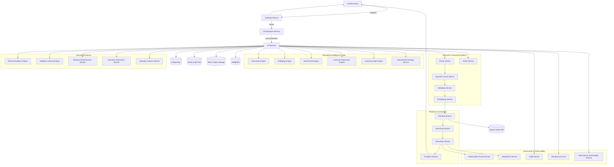
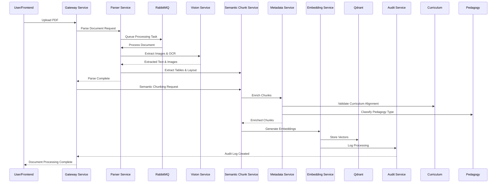
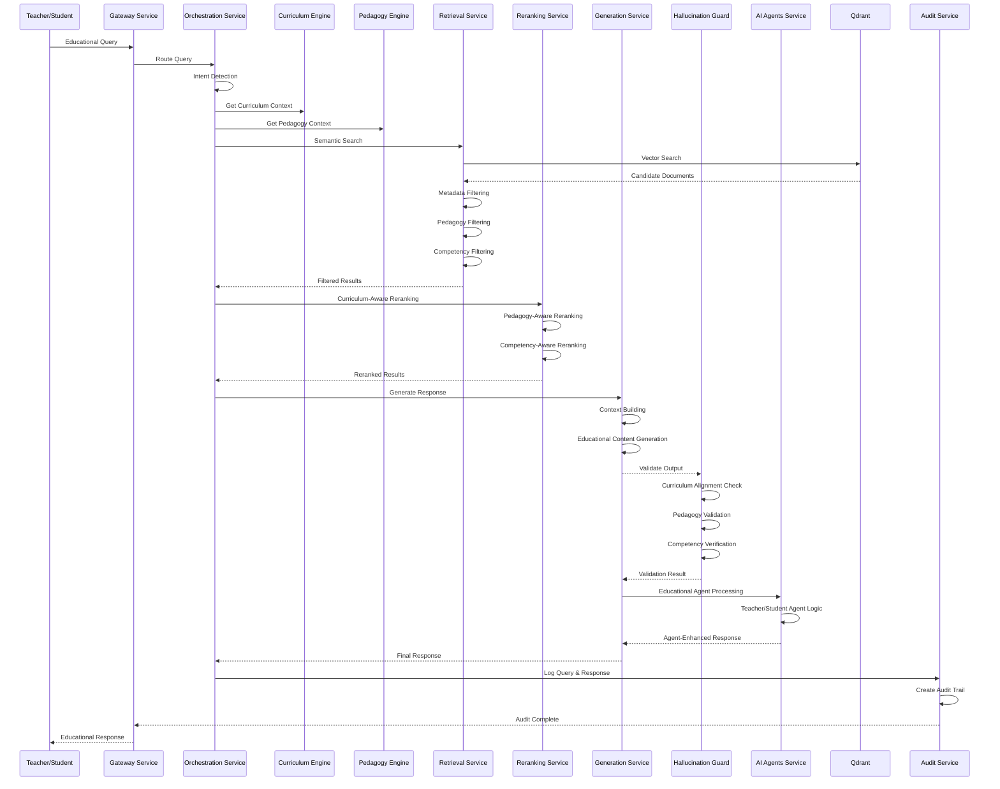
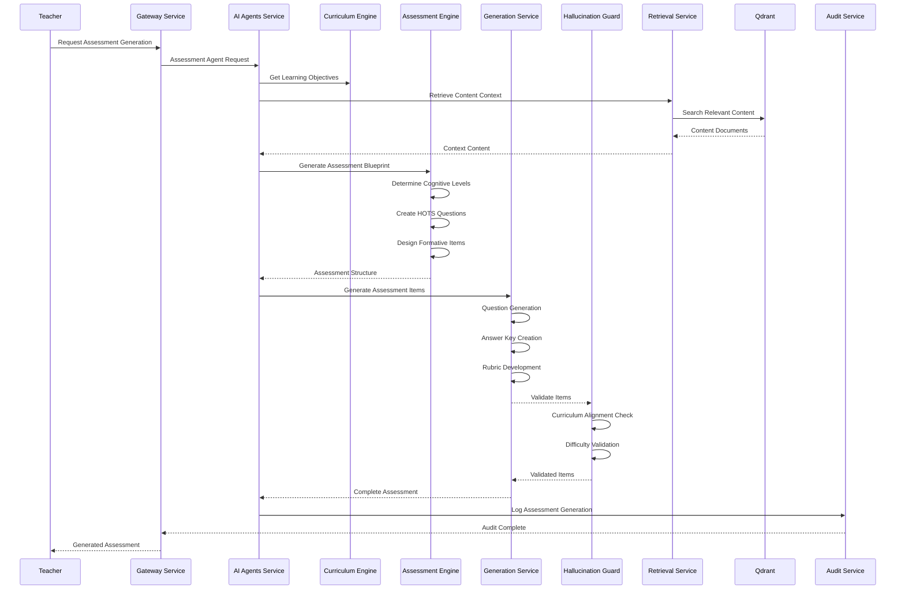
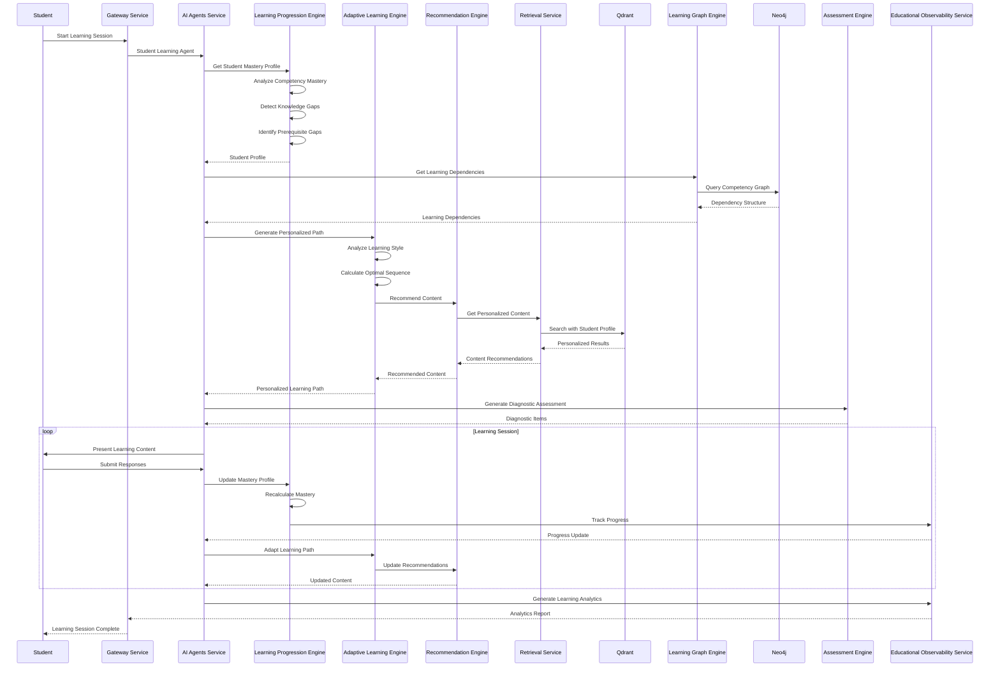

# AI Platform Workflow Documentation

## Overview

AI Platform adalah Educational Cognitive Infrastructure yang dirancang untuk memproses, memahami, dan menghasilkan konten pendidikan dengan kesadaran kurikulum, pedagogi, dan kompetensi. Platform ini menggunakan microservices architecture dengan 30+ services yang terintegrasi melalui gRPC dan message queues.

---

## High-Level Architecture Workflow



---

## User Journey Workflows

### 1. Document Ingestion & Processing Workflow

#### 1.1 Upload Document Flow



#### 1.2 Document Processing Steps

1. **Upload & Validation**
   - User uploads PDF through Frontend
   - Gateway Service validates file format and size
   - Document queued for processing

2. **Parsing Phase (Parser Service)**
   - Text extraction using PyMuPDF
   - Table extraction using Camelot
   - Image extraction for OCR
   - Layout detection using Unstructured
   - Formula extraction using Nougat OCR

3. **Vision Processing (Vision Service)**
   - OCR processing with Tesseract
   - Diagram analysis
   - Image classification
   - Formula extraction from images

4. **Semantic Chunking (Semantic Chunk Service)**
   - Competency-based chunking (KI-1, KI-2, KI-3, KI-4)
   - Activity-based chunking
   - Assessment-based chunking
   - Inquiry-based chunking
   - Lesson plan-based chunking

5. **Metadata Enrichment (Metadata Service)**
   - Difficulty level assignment
   - Bloom's taxonomy classification
   - Learning style detection
   - Competency tagging
   - Pedagogy tagging
   - Assessment metadata

6. **Embedding Generation (Embedding Service)**
   - Text embedding generation
   - Image embedding generation
   - Table embedding generation
   - Formula embedding generation

7. **Vector Storage**
   - Store embeddings in Qdrant
   - Index with metadata
   - Enable semantic search

---

### 2. Query & Retrieval Workflow

#### 2.1 Educational Query Processing



#### 2.2 Retrieval Enhancement Process

1. **Query Analysis**
   - Intent detection (teaching, learning, assessment, planning)
   - Context extraction (grade, phase, subject)
   - Competency identification

2. **Curriculum Context Loading**
   - Load relevant CP (Curriculum Program)
   - Load ATP (Annual Teaching Plan)
   - Identify learning objectives
   - Determine competency requirements

3. **Pedagogy Context Loading**
   - Identify pedagogical approach
   - Load teaching strategy context
   - Determine appropriate methods

4. **Semantic Search**
   - Generate query embedding
   - Vector similarity search in Qdrant
   - Retrieve candidate documents

5. **Multi-Stage Filtering**
   - Metadata filtering (grade, phase, subject)
   - Pedagogy filtering (inquiry, project-based, etc.)
   - Competency filtering (specific KI requirements)
   - Difficulty filtering

6. **Educational Reranking**
   - Curriculum-aware reranking
   - Pedagogy-aware reranking
   - Competency-aware reranking
   - Learning progression consideration

---

### 3. Assessment Generation Workflow

#### 3.1 Intelligent Assessment Creation



#### 3.2 Assessment Generation Steps

1. **Requirements Gathering**
   - Learning objectives from CP/ATP
   - Target competency level
   - Cognitive complexity requirements
   - Assessment type (formative, summative)

2. **Content Retrieval**
   - Retrieve relevant curriculum content
   - Get pedagogical context
   - Load learning progression data

3. **Assessment Design**
   - Blueprint creation
   - Cognitive level distribution (Bloom's)
   - Question type selection
   - Difficulty calibration

4. **Question Generation**
   - HOTS question generation
   - Multiple choice items
   - Open-ended questions
   - Performance tasks

5. **Quality Validation**
   - Curriculum alignment check
   - Pedagogy validation
   - Competency verification
   - Difficulty calibration

6. **Support Materials**
   - Answer key generation
   - Rubric development
   - Scoring guidelines
   - Teacher notes

---

### 4. Adaptive Learning Workflow

#### 4.1 Personalized Learning Path



#### 4.2 Adaptive Learning Process

1. **Student Profiling**
   - Mastery level assessment
   - Learning style detection
   - Knowledge gap analysis
   - Prerequisite evaluation

2. **Learning Graph Analysis**
   - Competency dependency mapping
   - Prerequisite relationship identification
   - Learning path optimization
   - Progress tracking graph

3. **Personalized Path Generation**
   - Individual learning style consideration
   - Mastery-based content selection
   - Adaptive difficulty adjustment
   - Optimal sequencing calculation

4. **Content Recommendation**
   - Personalized content filtering
   - Learning style matching
   - Competency-aligned selection
   - Difficulty calibration

5. **Continuous Adaptation**
   - Real-time performance tracking
   - Dynamic path adjustment
   - Mastery-based progression
   - Remedial content insertion

---

### 5. Curriculum Planning Workflow

#### 5.1 Intelligent Curriculum Planning

```mermaid
sequenceDiagram
    participant Teacher as Teacher
    participant Gateway as Gateway Service
    participant Agents as AI Agents Service
    participant Curriculum as Curriculum Engine
    participant Pedagogy as Pedagogy Engine
    participant Strategic as Strategic Analysis Service
    participant LearningGraph as Learning Graph Engine
    participant Retrieval as Retrieval Service
    participant Generation as Generation Service
    participant Hallucination as Hallucination Guard
    participant Qdrant as Qdrant
    participant Audit as Audit Service
    
    Teacher->>Gateway: Request Curriculum Planning
    Gateway->>Agents: Curriculum Agent Request
    Agents->>Curriculum: Load CP Framework
    Curriculum->>Curriculum: Validate Structure
    Curriculum-->>Agents: CP Context
    
    Agents->>Curriculum: Load ATP Template
    Curriculum->>Curriculum: Generate ATP Draft
    Curriculum->>Strategic: Strategic Analysis
    Strategic->>Strategic: SWOT Analysis
    Strategic->>Strategic: Root Cause Analysis
    Strategic->->Strategic: Fishbone Analysis
    Strategic->>Strategic: KSP Generation
    Strategic-->>Curriculum: Strategic Insights
    Curriculum-->>Agents: ATP Draft with Strategy
    
    Agents->>Pedagogy: Recommend Teaching Strategies
    Pedagogy->>Pedagogy: Analyze Content Type
    Pedagogy->->Pedagogy: Suggest Pedagogical Approach
    Pedagogy-->>Agents: Pedagogy Recommendations
    
    Agents->>LearningGraph: Get Learning Dependencies
    LearningGraph-->>Agents: Competency Dependencies
    
    Agents->>Retrieval: Get Teaching Resources
    Retrieval->>Qdrant: Search Educational Content
    Qdrant-->>Retrieval: Resource Materials
    Retrieval-->>Agents: Teaching Resources
    
    Agents->>Generation: Generate Lesson Plans
    Generation->>Generation: Create Weekly Plans
    Generation->>Generation: Design Learning Activities
    Generation->>Generation: Plan Assessments
    Generation-->>Hallucination: Validate Plans
    Hallucination->->Hallucination: Curriculum Alignment Check
    Hallucination->->Hallucination: Pedagogy Validation
    Hallucination-->>Generation: Validated Plans
    Generation-->>Agents: Complete Curriculum Plan
    
    Agents->>Audit: Log Planning Process
    Audit-->>Gateway: Audit Complete
    Gateway-->>Teacher: Intelligent Curriculum Plan
```

#### 5.2 Curriculum Planning Steps

1. **Framework Analysis**
   - Load CP structure
   - Validate curriculum requirements
   - Analyze phase and grade requirements
   - Identify competency distribution

2. **Strategic Planning**
   - SWOT analysis for subject/grade
   - Root cause analysis of learning challenges
   - Fishbone analysis for problem identification
   - Key Success Point (KSP) generation

3. **ATP Generation**
   - Annual teaching plan creation
   - Weekly learning objective allocation
   - Time distribution planning
   - Resource requirement planning

4. **Pedagogy Planning**
   - Teaching strategy recommendation
   - Learning approach selection
   - Activity type planning
   - Assessment strategy design

5. **Resource Planning**
   - Teaching material identification
   - Content resource retrieval
   - Activity material planning
   - Assessment resource preparation

6. **Quality Validation**
   - Curriculum alignment verification
   - Pedagogy appropriateness check
   - Feasibility validation
   - Quality assurance

---

### 6. AI Agents Workflow

#### 6.1 Educational Agent Orchestration

```mermaid
graph TB
    Query[User Query] --> Intent{Intent Detection}
    
    Intent -->|Teaching| TeacherAgent[Teacher Agent]
    Intent -->|Learning| StudentAgent[Student Agent]
    Intent -->|Curriculum| CurriculumAgent[Curriculum Agent]
    Intent -->|Assessment| AssessmentAgent[Assessment Agent]
    
    TeacherAgent --> LessonPlanning[Lesson Planning Assistant]
    TeacherAgent --> AssessmentCreation[Assessment Creation Assistant]
    TeacherAgent --> ProgressAnalysis[Student Progress Analysis]
    TeacherAgent --> StrategyRec[Teaching Strategy Recommendation]
    
    StudentAgent --> PersonalizedGuidance[Personalized Guidance]
    StudentAgent --> QuestionAnswering[Question Answering]
    StudentAgent --> PathRec[Learning Path Recommendation]
    StudentAgent --> AdaptiveInteraction[Adaptive Interaction]
    
    CurriculumAgent --> CPGuidance[CP Guidance]
    CurriculumAgent --> ATPGuidance[ATP Guidance]
    CurriculumAgent --> AlignmentCheck[Curriculum Alignment Checking]
    CurriculumAgent --> CurriculumRec[Curriculum Recommendation]
    CurriculumAgent --> ExpertKnowledge[Expert Knowledge Integration]
    
    AssessmentAgent --> AssessmentGen[Assessment Generation Assistant]
    AssessmentAgent --> RubricCreation[Rubric Creation Assistant]
    AssessmentAgent --> AssessmentAnalytics[Assessment Analytics]
    AssessmentAgent --> QualityValidation[Quality Validation]
    
    LessonPlanning --> CurriculumEngine[Curriculum Engine]
    LessonPlanning --> PedagogyEngine[Pedagogy Engine]
    LessonPlanning --> RetrievalService[Retrieval Service]
    LessonPlanning --> GenerationService[Generation Service]
    
    AssessmentCreation --> AssessmentEngine[Assessment Engine]
    AssessmentCreation --> LearningProgression[Learning Progression Engine]
    AssessmentCreation --> GenerationService[Generation Service]
    
    ProgressAnalysis --> ObservabilityService[Educational Observability Service]
    ProgressAnalysis --> LearningGraphEngine[Learning Graph Engine]
    ProgressAnalysis --> AnalyticsEngine[Analytics Engine]
    
    PersonalizedGuidance --> AdaptiveEngine[Adaptive Learning Engine]
    PersonalizedGuidance --> RecommendationEngine[Recommendation Engine]
    PersonalizedGuidance --> RetrievalService[Retrieval Service]
    
    PathRec --> LearningProgression[Learning Progression Engine]
    PathRec --> LearningGraphEngine[Learning Graph Engine]
    PathRec --> AdaptiveEngine[Adaptive Learning Engine]
    
    CPGuidance --> CurriculumEngine[Curriculum Engine]
    CPGuidance --> StrategicAnalysis[Strategic Analysis Service]
    CPGuidance --> GenerationService[Generation Service]
    
    ATPGuidance --> CurriculumEngine[Curriculum Engine]
    ATPGuidance --> PedagogyEngine[Pedagogy Engine]
    ATPGuidance --> StrategicAnalysis[Strategic Analysis Service]
    
    AlignmentCheck --> CurriculumEngine[Curriculum Engine]
    AlignmentCheck --> HallucinationGuard[Hallucination Guard Service]
    AlignmentCheck --> AuditService[Audit Service]
```



#### 6.2 Agent Capabilities

**Teacher Agent:**
- Lesson planning with curriculum alignment
- Assessment creation with cognitive complexity
- Student progress analysis with learning analytics
- Teaching strategy recommendation based on pedagogy

**Student Agent:**
- Personalized learning guidance
- Question answering with context awareness
- Learning path recommendation based on mastery
- Adaptive interaction based on performance

**Curriculum Agent:**
- CP development guidance
- ATP creation assistance
- Curriculum alignment verification
- Expert knowledge integration

**Assessment Agent:**
- Assessment generation with quality standards
- Rubric creation with fairness considerations
- Assessment analytics with insights
- Quality validation with educational standards

---

## Data Flow Architecture

### 1. Document Processing Data Flow

```text
┌─────────────────────────────────────────────────────────────┐
│                    DOCUMENT INGESTION                        │
└─────────────────────────────────────────────────────────────┘
                              │
                              ▼
┌─────────────────────────────────────────────────────────────┐
│  PARSER SERVICE                                            │
│  - Text Extraction (PyMuPDF)                               │
│  - Table Extraction (Camelot)                              │
│  - Image Extraction                                        │
│  - Layout Detection (Unstructured)                          │
└─────────────────────────────────────────────────────────────┘
                              │
                              ▼
┌─────────────────────────────────────────────────────────────┐
│  VISION SERVICE                                            │
│  - OCR Processing (Tesseract)                              │
│  - Diagram Analysis                                        │
│  - Formula Extraction (Nougat)                             │
│  - Image Classification                                     │
└─────────────────────────────────────────────────────────────┘
                              │
                              ▼
┌─────────────────────────────────────────────────────────────┐
│  SEMANTIC CHUNK SERVICE                                    │
│  - Competency-Based Chunking                               │
│  - Activity-Based Chunking                                 │
│  - Assessment-Based Chunking                               │
│  - Pedagogy Classification                                  │
└─────────────────────────────────────────────────────────────┘
                              │
                              ▼
┌─────────────────────────────────────────────────────────────┐
│  METADATA SERVICE                                          │
│  - Difficulty Enrichment                                   │
│  - Bloom's Taxonomy Classification                          │
│  - Competency Tagging                                      │
│  - Pedagogy Tagging                                        │
└─────────────────────────────────────────────────────────────┘
                              │
                              ▼
┌─────────────────────────────────────────────────────────────┐
│  EMBEDDING SERVICE                                         │
│  - Text Embedding (BAAI/bge-m3)                           │
│  - Image Embedding                                         │
│  - Table Embedding                                         │
│  - Formula Embedding                                       │
└─────────────────────────────────────────────────────────────┘
                              │
                              ▼
┌─────────────────────────────────────────────────────────────┐
│  QDRANT VECTOR DATABASE                                    │
│  - Vector Storage                                           │
│  - Metadata Indexing                                       │
│  - Semantic Search Enablement                              │
└─────────────────────────────────────────────────────────────┘
```

### 2. Query Processing Data Flow

```text
┌─────────────────────────────────────────────────────────────┐
│                    USER QUERY                               │
└─────────────────────────────────────────────────────────────┘
                              │
                              ▼
┌─────────────────────────────────────────────────────────────┐
│  GATEWAY SERVICE                                           │
│  - Request Validation                                      │
│  - Authentication                                         │
│  - Rate Limiting                                           │
└─────────────────────────────────────────────────────────────┘
                              │
                              ▼
┌─────────────────────────────────────────────────────────────┐
│  ORCHESTRATION SERVICE                                     │
│  - Intent Detection                                        │
│  - Context Extraction                                      │
│  - Strategy Selection                                      │
└─────────────────────────────────────────────────────────────┘
                              │
              ┌───────────────┴───────────────┐
              │                               │
              ▼                               ▼
┌──────────────────────────┐      ┌──────────────────────────┐
│  CURRICULUM ENGINE       │      │  PEDAGOGY ENGINE         │
│  - CP Context Loading     │      │  - Pedagogy Analysis     │
│  - ATP Context Loading    │      │  - Strategy Selection    │
│  - Competency Mapping     │      │  - Method Recommendation │
└──────────────────────────┘      └──────────────────────────┘
              │                               │
              └───────────────┬───────────────┘
                              │
                              ▼
┌─────────────────────────────────────────────────────────────┐
│  RETRIEVAL SERVICE                                         │
│  - Query Embedding                                         │
│  - Vector Search (Qdrant)                                  │
│  - Metadata Filtering                                      │
│  - Pedagogy Filtering                                      │
│  - Competency Filtering                                    │
└─────────────────────────────────────────────────────────────┘
                              │
                              ▼
┌─────────────────────────────────────────────────────────────┐
│  RERANKING SERVICE                                         │
│  - Curriculum-Aware Reranking                              │
│  - Pedagogy-Aware Reranking                                │
│  - Competency-Aware Reranking                              │
│  - Hybrid Reranking                                        │
└─────────────────────────────────────────────────────────────┘
                              │
                              ▼
┌─────────────────────────────────────────────────────────────┐
│  GENERATION SERVICE                                        │
│  - Context Building                                        │
│  - Educational Content Generation                          │
│  - Response Formatting                                    │
└─────────────────────────────────────────────────────────────┘
                              │
                              ▼
┌─────────────────────────────────────────────────────────────┐
│  HALLUCINATION GUARD SERVICE                               │
│  - Curriculum Alignment Check                              │
│  - Pedagogy Validation                                     │
│  - Competency Verification                                 │
│  - Factuality Check                                        │
└─────────────────────────────────────────────────────────────┘
                              │
                              ▼
┌─────────────────────────────────────────────────────────────┐
│  AI AGENTS SERVICE                                         │
│  - Educational Agent Processing                            │
│  - Response Enhancement                                    │
│  - Educational Quality Check                               │
└─────────────────────────────────────────────────────────────┘
                              │
                              ▼
┌─────────────────────────────────────────────────────────────┐
│  AUDIT SERVICE                                             │
│  - Query Logging                                           │
│  - Response Logging                                        │
│  - Retrieval Logging                                       │
│  - AI Traceability                                         │
└─────────────────────────────────────────────────────────────┘
```

---

## Integration Patterns

### 1. Synchronous gRPC Communication

Used for:
- Real-time query processing
- Interactive AI responses
- Direct service-to-service calls
- Low-latency requirements

Services using gRPC:
- Gateway Service → All AI Services
- Orchestration Service → Educational Intelligence Layer
- AI Agents Service → Specialized Services

### 2. Asynchronous Message Queue Processing

Used for:
- Document processing pipeline
- Batch operations
- Long-running tasks
- Background processing

Services using RabbitMQ:
- Parser Service (document queue)
- Embedding Service (vector generation queue)
- Retrieval Enhancement Service (batch processing)
- Educational Observability Service (analytics queue)

### 3. Database Integration Patterns

**PostgreSQL Integration:**
- Structured business data
- User management data
- Audit logs
- Governance records

**Qdrant Vector Database:**
- Semantic search
- Document embeddings
- Metadata filtering
- Educational content indexing

**Neo4j Graph Database:**
- Learning graphs
- Competency relationships
- Prerequisite mappings
- Knowledge structures

**MinIO Object Storage:**
- Document storage
- Image storage
- Extracted assets
- Model artifacts

---

## Service Communication Matrix

| Service | Communication Pattern | Database Integration | Queue Integration |
|---------|----------------------|---------------------|-------------------|
| Gateway Service | gRPC (Inbound) | PostgreSQL | - |
| Parser Service | gRPC + Queue | MinIO | RabbitMQ |
| Vision Service | gRPC | MinIO | - |
| Semantic Chunk Service | gRPC | PostgreSQL | RabbitMQ |
| Metadata Service | gRPC | PostgreSQL | RabbitMQ |
| Embedding Service | gRPC + Queue | Qdrant | RabbitMQ |
| Retrieval Service | gRPC | Qdrant, PostgreSQL | - |
| Reranking Service | gRPC | Qdrant | - |
| Generation Service | gRPC | - | RabbitMQ |
| AI Agents Service | gRPC | PostgreSQL | - |
| Curriculum Engine | gRPC | PostgreSQL, Neo4j | - |
| Pedagogy Engine | gRPC | PostgreSQL | - |
| Assessment Engine | gRPC | PostgreSQL | RabbitMQ |
| Learning Progression Engine | gRPC | PostgreSQL, Neo4j | RabbitMQ |
| Learning Graph Engine | gRPC | Neo4j | - |
| Educational Ontology Service | gRPC | Neo4j | - |
| Adaptive Learning Engine | gRPC | PostgreSQL, Neo4j | RabbitMQ |
| Recommendation Engine | gRPC | Qdrant, PostgreSQL | RabbitMQ |
| Strategic Analysis Service | gRPC | PostgreSQL, Neo4j | RabbitMQ |
| Hallucination Guard Service | gRPC | PostgreSQL | - |
| Moderation Service | gRPC | PostgreSQL | - |
| Audit Service | gRPC + Queue | PostgreSQL | RabbitMQ |
| Monitoring Service | gRPC | - | RabbitMQ |
| Educational Observability Service | gRPC + Queue | PostgreSQL | RabbitMQ |

---

## Error Handling & Resilience

### 1. Service Level Error Handling

**Parser Service:**
- Document parsing failures → Queue retry mechanism
- OCR failures → Fallback to text extraction
- Timeout handling → Progressive processing

**Retrieval Service:**
- Vector search failures → Fallback to keyword search
- Empty results → Query expansion
- Timeout handling → Cached results

**Generation Service:**
- LLM API failures → Model fallback
- Content validation failures → Regeneration
- Timeout handling → Partial response delivery

### 2. Circuit Breaker Patterns

**External API Integration:**
- OpenAI API circuit breaker
- Anthropic API circuit breaker
- Rate limit handling
- Exponential backoff

**Database Integration:**
- PostgreSQL connection pool circuit breaker
- Qdrant connection circuit breaker
- Neo4j connection circuit breaker

### 3. Retry Mechanisms

**Queue Processing:**
- Exponential backoff for failed messages
- Dead letter queue for persistent failures
- Manual retry capability

**Service Communication:**
- gRPC retry with backoff
- Timeout configuration per service
- Fallback service invocation

---

## Monitoring & Observability

### 1. Service Level Monitoring

**Health Checks:**
- Service availability
- Database connectivity
- Queue connectivity
- External API status

**Performance Metrics:**
- Request latency
- Processing time
- Queue depth
- Cache hit rates

### 2. Educational Metrics

**Content Processing:**
- Documents processed
- Chunks generated
- Embeddings created
- Metadata enrichment accuracy

**Query Processing:**
- Query volume
- Retrieval accuracy
- Response relevance
- User satisfaction

**Learning Analytics:**
- Student engagement
- Learning progression
- Mastery improvement
- Adaptive effectiveness

### 3. AI Governance Metrics

**Hallucination Detection:**
- False positive rate
- False negative rate
- Curriculum alignment score
- Pedagogy validation score

**Audit Metrics:**
- Query logging coverage
- Response traceability
- Retrieval logging accuracy
- AI decision transparency

---

## Security & Governance

### 1. Authentication & Authorization

**Gateway Service:**
- JWT token validation
- Role-based access control
- API key management
- Rate limiting per user

**Service-Level Security:**
- gRPC authentication
- Service-to-service authentication
- Network isolation
- Secret management

### 2. Data Privacy

**Student Data Protection:**
- PII identification
- Data anonymization
- Access logging
- Retention policies

**Content Security:**
- Input sanitization
- Output validation
- Content moderation
- Sensitive content filtering

### 3. AI Governance

**Transparency:**
- Decision logging
- Model versioning
- Response explanation
- Attribution tracking

**Accountability:**
- Audit trails
- Performance monitoring
- Bias detection
- Fairness evaluation

---

## Deployment Architecture

### 1. Development Environment

```text
Local Development
├── Docker Compose
├── Service Containers
├── Local Databases
└── Development Queues
```

### 2. Staging Environment

```text
Staging Environment
├── Kubernetes Cluster
├── Service Pods
├── Managed Databases
└── Production-like Queues
```

### 3. Production Environment

```text
Production Environment
├── Multi-Region Kubernetes
├── Auto-scaling Services
├── Managed Database Services
├── Enterprise Queue Systems
└── CDN + Load Balancing
```

---

## Performance Optimization

### 1. Caching Strategies

**Response Caching:**
- Educational content responses
- Curriculum context data
- Pedagogy recommendations
- Assessment templates

**Embedding Caching:**
- Document embeddings
- Query embeddings
- Vector search results
- Metadata filters

### 2. Database Optimization

**PostgreSQL:**
- Index optimization
- Query optimization
- Connection pooling
- Read replicas

**Qdrant:**
- Vector indexing
- Payload indexing
- Collection optimization
- Memory management

**Neo4j:**
- Graph indexing
- Query optimization
- Caching strategies
- Memory management

### 3. Service Optimization

**Load Balancing:**
- Service instances scaling
- Request distribution
- Geographic routing
- Capacity planning

**Resource Management:**
- Memory optimization
- CPU utilization
- I/O optimization
- Network efficiency

---

## Future Enhancements

### 1. Advanced AI Features

**Multimodal Understanding:**
- Video processing capabilities
- Audio content analysis
- Interactive diagram understanding
- AR/VR content support

**Advanced Reasoning:**
- Multi-step reasoning chains
- Educational logic inference
- Complex problem solving
- Creative thinking simulation

### 2. Enhanced Personalization

**Real-time Adaptation:**
- Biometric feedback integration
- Emotional state recognition
- Learning environment optimization
- Social learning facilitation

**Predictive Analytics:**
- Learning outcome prediction
- Dropout risk identification
- Performance forecasting
- Intervention recommendation

### 3. Expanded Ecosystem

**Integration Capabilities:**
- LMS platform integration
- Student information systems
- Learning analytics platforms
- Educational content repositories

**Collaboration Features:**
- Teacher collaboration tools
- Student peer learning
- Parent engagement features
- Administrator dashboards

---

## Conclusion

AI Platform Workflow dirancang sebagai Educational Cognitive Infrastructure yang menggabungkan:

1. **Document Intelligence**: Automated processing dan understanding konten pendidikan
2. **Educational Intelligence**: Deep understanding of curriculum, pedagogy, dan kompetensi
3. **Adaptive Learning**: Personalized learning paths berdasarkan mastery progression
4. **AI Governance**: Comprehensive audit, traceability, dan quality assurance
5. **Scalability**: Microservices architecture yang support horizontal scaling

Platform ini memastikan bahwa setiap educational AI interaction adalah:
- **Curriculum-aware**: Menghormati struktur Kurikulum Merdeka
- **Pedagogy-aware**: Mengikuti prinsip pedagogi yang benar
- **Competency-aware**: Berbasis mastery learning progression
- **Governance-first**: Memiliki auditability dan traceability
- **Educationally sound**: Memvalidasi educational quality

Dengan architecture ini, AI Platform menyediakan foundation yang solid untuk educational AI applications yang tidak hanya cerdas, tetapi juga educationally responsible.